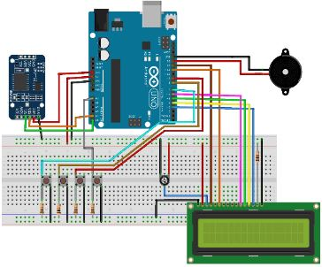
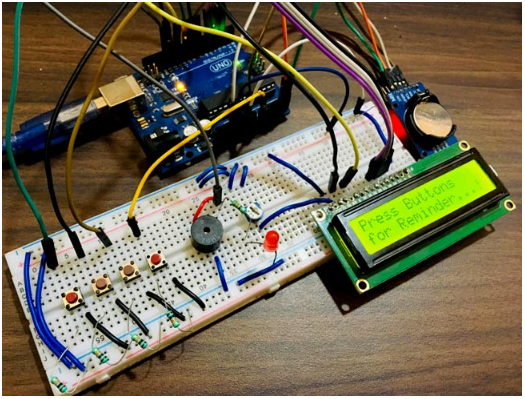

# Medicine-Reminder-Using-Arduino
To get maximum benefit from your medications, it is important to take them exactly as prescribed by your doctor. In fact, your chance of a better health outcome improves when you take your medications as directed.
In this project we have proposed a medicine reminder using Arduino which will help you to remind times when you are restricted to take medicine. We have used real time module to check time corresponding to alarm set in our Arduino based device. Also we have implemented a cardboard box using servo motor which will give you which particular medicine you need to take. Medicine Reminder Using Arduino which reminds to take medicines 1 or 2 or 3 times a day. The time slot can be selected using push buttons. Also, it shows current Date and Time using LCD.
 
## Steps to run the project 
1. Download the arduino IDE by visiting the link https://www.arduino.cc/en/main/software

2. Code required for the below setup is provided in medicine_reminder_code.ino file. All the necessary comment is available to understand the code.

3. Buy the required components such as - 
i) Arduino Uno (We can use other Arduino boards also, like Promini, Nano)
ii) RTC DS3231 module
iii) 16x2 LCD Display
iv) Buzzer 
v) Led (any color)
vi) Breadboard
vii) Push Buttons
viii) 10K Potentiometerix) 10K, 1K Resistors
x) Jumper Wires

4. With the help of below diagram, make all the necessary connections - 

5. Now connect the arduino uno cable with your laptop device and configure the PORT number in device manager accordingly.

6. Finally run the program which will look as shown below - 

## References 
1. https://www.youtube.com/watch?v=3SQGt3E-Jgs
2. https://en.wikipedia.org/wiki/Pill_reminder
3. https://www.hackster.io/TechnicalEngineer/medicine-reminder-using-arduino-dad47d
